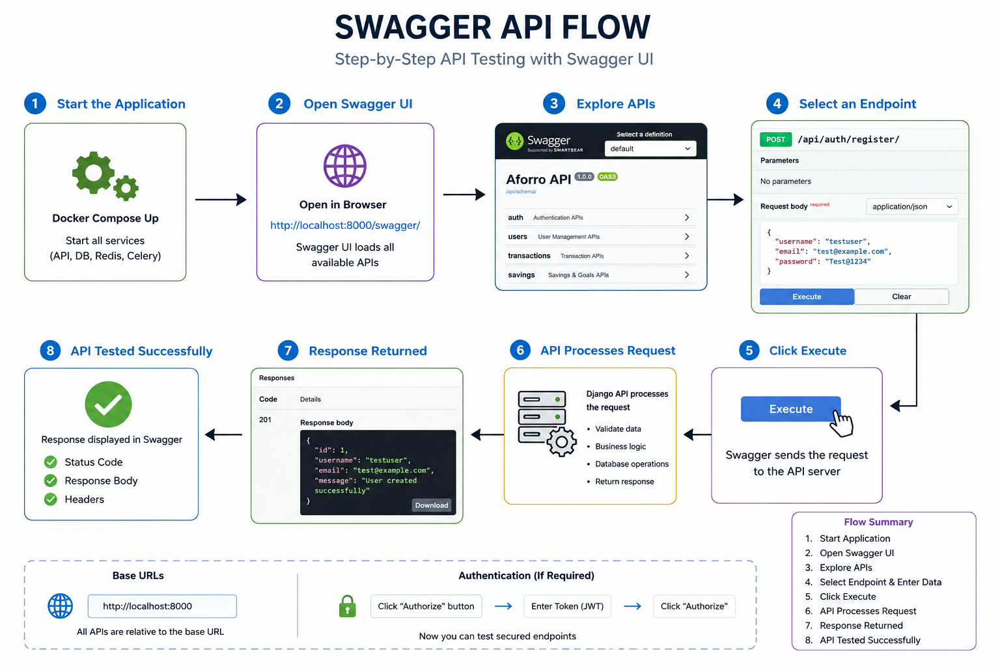

# Swagger API Test Guide — Aforro Backend

A step-by-step flow for testing every endpoint through the Swagger UI at
`http://localhost:8000/api/docs/`

---

## How Swagger API Testing Works



> **Flow Summary:**
> 1. **Start Application** — `docker compose up --build -d`
> 2. **Open Swagger UI** — `http://localhost:8000/api/docs/`
> 3. **Explore APIs** — browse all available endpoint sections (orders, stores, api)
> 4. **Select an Endpoint** — click to expand, then click **Try it out**
> 5. **Click Execute** — Swagger sends the live request to the API server
> 6. **API Processes Request** — Django validates data, runs business logic, queries DB
> 7. **Response Returned** — HTTP status code + response body displayed in Swagger
> 8. **API Tested Successfully** — verify status code, response body, and headers

---

## Prerequisites

Make sure the project is running before starting:

```bash
# Start all services
docker compose up --build -d

# Seed the database (run once)
docker compose exec api python manage.py seed_data

# Confirm all containers are healthy
docker compose ps
```

All five services must show **healthy / running**:

| Container | Status |
|---|---|
| `aforro-db-1` | healthy |
| `aforro-redis-1` | healthy |
| `aforro-api-1` | running |
| `aforro-celery_worker-1` | running |
| `aforro-celery_beat-1` | running |

---

## Open Swagger UI

Navigate to:

```
http://localhost:8000/api/docs/
```

You will see three sections in the Swagger UI:

| Section | Endpoints |
|---|---|
| **api** | `GET /api/schema/`, `GET /api/search/products/`, `GET /api/search/suggest/` |
| **orders** | `POST /orders/`, `GET /stores/{store_id}/orders/` |
| **stores** | `GET /stores/{store_id}/inventory/` |

---

## Test Flow

Follow the steps below in order. Each step builds on the previous one using real IDs returned from the API.

---

### STEP 1 — Get a valid Store ID and Product ID

Before creating orders you need real IDs from the seeded data.

**1a. Test Inventory Listing to get a Store ID and Product IDs**

In Swagger UI:

1. Click `GET /stores/{store_id}/inventory/`
2. Click **Try it out**
3. Enter `store_id`: `1`
4. Click **Execute**

**Expected response — HTTP 200:**

```json
[
  {
    "id": 14,
    "product_title": "Adidas Ultraboost 23",
    "product_price": "8999.00",
    "category_name": "Fashion",
    "quantity": 45
  },
  {
    "id": 7,
    "product_title": "Apple Watch Series 9",
    "product_price": "41900.00",
    "category_name": "Electronics",
    "quantity": 12
  }
]
```

> Note the `id` values — these are the **inventory row IDs**, not product IDs.
> To get product IDs, use the Product Search endpoint in Step 2.

**What to note down:**
- `store_id` = `1` ✅ (confirmed it exists)
- Products are sorted alphabetically by `product_title` ✅
- Response is **cached in Redis** after this first call ✅

---

### STEP 2 — Search for Products and Get Product IDs

**2a. Keyword Search**

1. Click `GET /api/search/products/`
2. Click **Try it out**
3. Fill in:
   - `q`: `samsung`
4. Click **Execute**

**Expected response — HTTP 200:**

```json
{
  "count": 5,
  "next": null,
  "previous": null,
  "page": 1,
  "total_pages": 1,
  "results": [
    {
      "id": 4,
      "title": "Samsung Galaxy S24",
      "description": "Experience the best of Electronics with Samsung Galaxy S24.",
      "price": "79999.00",
      "category_name": "Electronics",
      "created_at": "2024-06-01T00:00:00Z",
      "store_quantity": null
    }
  ]
}
```

> **Note down a product `id`** (e.g. `4`) — you will use this in the order creation step.

---

**2b. Category Filter**

1. Clear `q`, set `category`: `electronics`
2. Click **Execute**

Returns only Electronics products. ✅

---

**2c. Price Range Filter**

1. Set `price_min`: `10000`, `price_max`: `50000`
2. Click **Execute**

Returns only products priced between ₹10,000 and ₹50,000. ✅

---

**2d. Sort by Price (Ascending)**

1. Set `sort`: `price_asc`
2. Click **Execute**

First result has the lowest price in the result set. ✅

---

**2e. Sort by Price (Descending)**

1. Set `sort`: `price_desc`
2. Click **Execute**

First result has the highest price in the result set. ✅

---

**2f. Sort by Newest**

1. Set `sort`: `newest`
2. Click **Execute**

Results ordered by `created_at` descending. ✅

---

**2g. Search with Store Filter (adds store_quantity)**

1. Set `q`: `iphone`, `store_id`: `1`
2. Click **Execute**

Each result now includes `store_quantity` (integer, not null):

```json
{
  "id": 1,
  "title": "iPhone 15",
  "price": "79900.00",
  "category_name": "Electronics",
  "store_quantity": 23
}
```

✅ `store_quantity` is populated only when `store_id` is provided.

---

**2h. In-Stock Filter**

1. Set `store_id`: `1`, `in_stock`: `true`
2. Click **Execute**

Returns only products where `store_quantity > 0` for store 1. ✅

---

**2i. Pagination**

1. Remove all filters, set `page_size`: `5`
2. Click **Execute**

Response includes:

```json
{
  "count": 1050,
  "next": "http://localhost:8000/api/search/products/?page=2&page_size=5",
  "previous": null,
  "page": 1,
  "total_pages": 210
}
```

✅ Pagination metadata confirmed.

---

### STEP 3 — Test Autocomplete

1. Click `GET /api/search/suggest/`
2. Click **Try it out**

---

**3a. Valid query (prefix match)**

1. Set `q`: `sam`
2. Click **Execute**

**Expected response — HTTP 200:**

```json
{
  "suggestions": [
    "Samsung Galaxy S24",
    "Samsung Galaxy S23 Ultra",
    "Samsung Galaxy Watch 6",
    "Samsung Galaxy Tab S9",
    "Samsung 970 EVO SSD"
  ]
}
```

- All results start with `sam` (prefix matches first) ✅
- Maximum 10 results ✅

---

**3b. General contains match**

1. Set `q`: `ple`
2. Click **Execute**

**Expected response — HTTP 200:**

```json
{
  "suggestions": [
    "Apple Watch Series 9",
    "Apple iPad Air",
    "Pineapple Ring"
  ]
}
```

- None start with `ple` so all are general `icontains` matches ✅

---

**3c. Too short — validation error**

1. Set `q`: `sa` (only 2 characters)
2. Click **Execute**

**Expected response — HTTP 400:**

```json
{
  "error": "Minimum 3 characters required.",
  "suggestions": []
}
```

✅ Validation enforced.

---

### STEP 4 — Create a CONFIRMED Order

Use a `product_id` you noted from Step 2 and `store_id` = `1`.

1. Click `POST /orders/`
2. Click **Try it out**
3. Replace the request body with:

```json
{
  "store_id": 1,
  "items": [
    {
      "product_id": 4,
      "quantity_requested": 2
    }
  ]
}
```

4. Click **Execute**

**Expected response — HTTP 201:**

```json
{
  "id": 1,
  "store_id": 1,
  "store_name": "Chennai Central Store",
  "status": "CONFIRMED",
  "created_at": "2024-06-01T10:30:00Z",
  "items": [
    {
      "id": 1,
      "product_id": 4,
      "product_title": "Samsung Galaxy S24",
      "quantity_requested": 2
    }
  ],
  "total_items": 0
}
```

**Verify what happened:**

- `status` is `CONFIRMED` ✅
- `items` array contains the product with correct `product_id` and `product_title` ✅
- `total_items` is `0` on the create response — this is expected behavior; the `total_items` annotation (`Count('items')`) is only applied on the order listing endpoint, not on the create serializer ✅

**Verify inventory was deducted:**

Go back to `GET /stores/1/inventory/` and execute again.  
The product's `quantity` should be reduced by `2` compared to Step 1.  
Also notice this call hits the database again (cache was invalidated by the CONFIRMED order). ✅

---

### STEP 5 — Create a REJECTED Order (Insufficient Stock)

1. Click `POST /orders/`
2. Click **Try it out**
3. Use the same `product_id` from Step 4 but request a quantity higher than available stock:

```json
{
  "store_id": 1,
  "items": [
    {
      "product_id": 4,
      "quantity_requested": 999999
    }
  ]
}
```

4. Click **Execute**

**Expected response — HTTP 201:**

```json
{
  "order_id": 2,
  "status": "REJECTED",
  "created_at": "2024-06-01T10:31:00Z",
  "rejection_reasons": {
    "missing_products": [],
    "insufficient_stock": [
      {
        "product_id": 4,
        "available": 498,
        "requested": 999999
      }
    ]
  },
  "items": []
}
```

**Verify:**

- `status` is `REJECTED` ✅
- `rejection_reasons.insufficient_stock` lists the product with `available` vs `requested` ✅
- `missing_products` is empty (product exists, just not enough stock) ✅
- Inventory is **NOT deducted** — go back to `GET /stores/1/inventory/` and confirm quantity is unchanged ✅

---

### STEP 6 — Create a REJECTED Order (Product Not in Store)

Use a product that exists in the catalog but has no inventory entry for store `1`.

1. Click `POST /orders/`
2. Click **Try it out**
3. Use `store_id`: `2` and `product_id`: `4` (which may not have inventory in store 2):

```json
{
  "store_id": 2,
  "items": [
    {
      "product_id": 4,
      "quantity_requested": 1
    }
  ]
}
```

4. Click **Execute**

**If the product has no inventory in store 2 — Expected response — HTTP 201:**

```json
{
  "order_id": 3,
  "status": "REJECTED",
  "created_at": "2024-06-01T10:32:00Z",
  "rejection_reasons": {
    "missing_products": [4],
    "insufficient_stock": []
  },
  "items": []
}
```

- `missing_products` contains the product ID ✅
- `insufficient_stock` is empty ✅

---

### STEP 7 — Create a Multi-Item CONFIRMED Order

Test that ALL items must pass stock validation.

1. First find two product IDs in store 1 with stock > 0 (from the inventory listing)
2. Click `POST /orders/`
3. Click **Try it out**

```json
{
  "store_id": 1,
  "items": [
    {
      "product_id": 4,
      "quantity_requested": 1
    },
    {
      "product_id": 7,
      "quantity_requested": 1
    }
  ]
}
```

4. Click **Execute**

**Expected — HTTP 201, CONFIRMED:**

```json
{
  "id": 4,
  "store_id": 1,
  "store_name": "Chennai Central Store",
  "status": "CONFIRMED",
  "created_at": "2024-06-01T10:33:00Z",
  "items": [
    { "id": 3, "product_id": 4, "product_title": "Samsung Galaxy S24", "quantity_requested": 1 },
    { "id": 4, "product_id": 7, "product_title": "Apple Watch Series 9", "quantity_requested": 1 }
  ],
  "total_items": 0
}
```

Both items confirmed ✅. Both quantities deducted from inventory ✅.

---

### STEP 8 — Verify Order Listing

1. Click `GET /stores/{store_id}/orders/`
2. Click **Try it out**
3. Enter `store_id`: `1`
4. Click **Execute**

**Expected response — HTTP 200:**

```json
{
  "count": 4,
  "results": [
    {
      "id": 4,
      "status": "CONFIRMED",
      "created_at": "2024-06-01T10:33:00Z",
      "total_items": 2
    },
    {
      "id": 3,
      "status": "REJECTED",
      "created_at": "2024-06-01T10:32:00Z",
      "total_items": 0
    },
    {
      "id": 2,
      "status": "REJECTED",
      "created_at": "2024-06-01T10:31:00Z",
      "total_items": 1
    },
    {
      "id": 1,
      "status": "CONFIRMED",
      "created_at": "2024-06-01T10:30:00Z",
      "total_items": 1
    }
  ]
}
```

**Verify:**

- Orders sorted **newest first** ✅
- Each result has exactly: `id`, `status`, `created_at`, `total_items` ✅
- `total_items` here is the **count of order item rows** (line items), annotated via `Count('items')` — not a sum of quantities ✅
- `count` in the wrapper matches the total number of orders for the store ✅

---

### STEP 9 — Verify Redis Cache Invalidation

This confirms the inventory cache is correctly cleared after a CONFIRMED order.

```bash
# Check Redis keys before any request
docker compose exec redis redis-cli keys "*"

# Make first inventory request (MISS — queries DB, stores in cache)
curl http://localhost:8000/stores/1/inventory/

# Check Redis — cache key should now exist
docker compose exec redis redis-cli keys "*inventory*"
# Expected: "inventory_store_1"

# Check TTL (should be close to 300)
docker compose exec redis redis-cli ttl "inventory_store_1"

# Make second inventory request (HIT — served from Redis, no DB query)
curl http://localhost:8000/stores/1/inventory/

# Create a CONFIRMED order (this invalidates the cache)
curl -X POST http://localhost:8000/orders/ \
  -H "Content-Type: application/json" \
  -d '{"store_id": 1, "items": [{"product_id": 4, "quantity_requested": 1}]}'

# Check Redis again — cache key should be GONE
docker compose exec redis redis-cli keys "*inventory*"
# Expected: (empty list)

# Make inventory request again (MISS — cache was busted, queries DB with updated stock)
curl http://localhost:8000/stores/1/inventory/
```

---

### STEP 10 — Verify Celery Task Execution

After every CONFIRMED order, `send_order_confirmation` runs asynchronously.

```bash
# Watch the celery worker logs
docker compose logs -f celery_worker
```

You should see output like:

```
[2024-06-01 10:30:00] INFO Task apps.orders.tasks.send_order_confirmation[abc-123] received
[2024-06-01 10:30:00] INFO Order Confirmation
                            ==================
                            Order ID : 1
                            Store    : Chennai Central Store
                            Status   : CONFIRMED
                            Created  : 2024-06-01 10:30:00+00:00
                            Items    :
                              - Samsung Galaxy S24 x 2
[2024-06-01 10:30:00] INFO Task apps.orders.tasks.send_order_confirmation[abc-123] succeeded
```

✅ Task received, executed, and succeeded.

---

## Complete API Reference

| Method | Endpoint | Description |
|---|---|---|
| `POST` | `/orders/` | Create a new order |
| `GET` | `/stores/{store_id}/orders/` | List all orders for a store |
| `GET` | `/stores/{store_id}/inventory/` | List inventory for a store (cached) |
| `GET` | `/api/search/products/` | Search and filter products |
| `GET` | `/api/search/suggest/` | Autocomplete product titles |
| `GET` | `/api/schema/` | Raw OpenAPI schema (YAML) |
| `GET` | `/api/docs/` | Swagger UI |
| `GET` | `/admin/` | Django admin panel |

---

## Response Field Reference

### `POST /orders/` — CONFIRMED response

| Field | Type | Description |
|---|---|---|
| `id` | integer | Order ID |
| `store_id` | integer | Store ID |
| `store_name` | string | Store name |
| `status` | string | `CONFIRMED` |
| `created_at` | datetime | ISO 8601 timestamp |
| `items[].id` | integer | OrderItem row ID |
| `items[].product_id` | integer | Product ID |
| `items[].product_title` | string | Product title |
| `items[].quantity_requested` | integer | Quantity in this order |
| `total_items` | integer | Defaults to `0` on create response |

### `POST /orders/` — REJECTED response

| Field | Type | Description |
|---|---|---|
| `order_id` | integer | Order ID |
| `status` | string | `REJECTED` |
| `created_at` | datetime | ISO 8601 timestamp |
| `rejection_reasons.missing_products` | array | Product IDs not found in store inventory |
| `rejection_reasons.insufficient_stock[].product_id` | integer | Product ID |
| `rejection_reasons.insufficient_stock[].available` | integer | Current stock |
| `rejection_reasons.insufficient_stock[].requested` | integer | Requested quantity |
| `items` | array | Empty array on REJECTED |

### `GET /stores/{store_id}/orders/` — response

| Field | Type | Description |
|---|---|---|
| `count` | integer | Total orders for this store |
| `results[].id` | integer | Order ID |
| `results[].status` | string | `CONFIRMED`, `REJECTED`, or `PENDING` |
| `results[].created_at` | datetime | ISO 8601 timestamp |
| `results[].total_items` | integer | Count of order item rows (via `Count('items')`) |

### `GET /stores/{store_id}/inventory/` — response (array)

| Field | Type | Description |
|---|---|---|
| `id` | integer | Inventory row ID |
| `product_title` | string | Product title (sorted alphabetically) |
| `product_price` | decimal | Product price as string |
| `category_name` | string | Category name |
| `quantity` | integer | Current stock quantity |

### `GET /api/search/products/` — response

| Field | Type | Description |
|---|---|---|
| `count` | integer | Total matching products |
| `next` | string or null | URL of next page |
| `previous` | string or null | URL of previous page |
| `page` | integer | Current page number |
| `total_pages` | integer | Total number of pages |
| `results[].id` | integer | Product ID |
| `results[].title` | string | Product title |
| `results[].description` | string or null | Product description |
| `results[].price` | decimal | Price as string |
| `results[].category_name` | string | Category name |
| `results[].created_at` | datetime | ISO 8601 timestamp |
| `results[].store_quantity` | integer or null | Stock in requested store; `null` if no `store_id` given |

### `GET /api/search/suggest/` — response

| Field | Type | Description |
|---|---|---|
| `suggestions` | array of strings | Up to 10 product titles; prefix matches first |

---

## Common Errors

| Scenario | HTTP Status | Response |
|---|---|---|
| Store not found | `404` | `{"detail": "Not found."}` |
| Autocomplete query < 3 chars | `400` | `{"error": "Minimum 3 characters required.", "suggestions": []}` |
| Invalid request body | `400` | DRF validation error with field-level messages |
| Duplicate `product_id` in order items | `400` | `{"items": ["Duplicate product_id found in items."]}` |
| Missing required field | `400` | `{"store_id": ["This field is required."]}` |